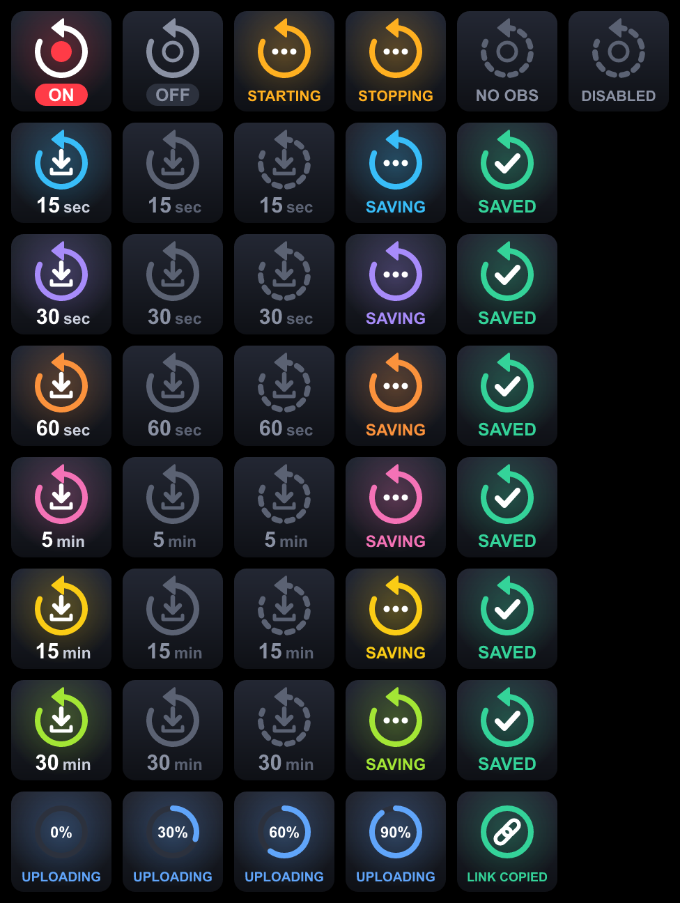

# OBS Replay Buffer Pro for Stream Deck

A Stream Deck plugin for the [Replay Buffer Pro](https://github.com/JoshuaPotter/replay-buffer-pro) OBS plugin:
turn OBS's replay buffer on and off, and save anything from the last 15 seconds to the last 30 minutes, each
with a single key press. Optionally, saved clips are uploaded to your [chibisafe](https://github.com/chibisafe/chibisafe)
server and the link is copied to your clipboard.

| Action | What it does |
| --- | --- |
| **Replay Buffer On/Off** | One key that starts or stops the OBS replay buffer and shows whether it's running. |
| **Save Last 15 sec** | Saves the last 15 seconds. |
| **Save Last 30 sec** | Saves the last 30 seconds. |
| **Save Last 60 sec** | Saves the last 60 seconds. |
| **Save Last 5 min** | Saves the last 5 minutes. |
| **Save Last 15 min** | Saves the last 15 minutes. |
| **Save Last 30 min** | Saves the last 30 minutes. |

Top row: the toggle when on, off, starting, stopping, not connected to OBS, and with the replay buffer disabled in OBS.
Middle rows: each save key when ready, when the replay buffer is off, when not connected, while saving, and once saved.
Bottom row: a save key while its clip uploads to chibisafe, and once the link is copied.

## Requirements

- Stream Deck app 7.1 or newer (Windows 10+ or macOS 12+)
- OBS Studio 28 or newer (its WebSocket server is built in)
- The [Replay Buffer Pro](https://github.com/JoshuaPotter/replay-buffer-pro) OBS plugin, version 1.4.0 or newer,
  with the replay buffer enabled in OBS (Settings → Output → Replay Buffer)
- Optional: a [chibisafe](https://github.com/chibisafe/chibisafe) server and API key, to upload clips

## Install

1. Install the Replay Buffer Pro OBS plugin (version 1.4.0 or newer) by following its
   [installation steps](https://github.com/JoshuaPotter/replay-buffer-pro#installation), and turn on the replay
   buffer in OBS (Settings → Output → Replay Buffer).
2. Download `com.replay-buffer-pro.obs.streamDeckPlugin` from the
   [latest release](https://github.com/jerptrs/streamdeck-replay-buffer-pro/releases/latest) and double-click it.
3. In OBS open **Tools → WebSocket Server Settings**, tick **Enable WebSocket server**, then click
   **Show Connect Info**.
4. Drag any of the actions from the **OBS Replay Buffer Pro** category onto your Stream Deck. In its settings
   panel, enter the host (`127.0.0.1` if OBS runs on the same PC), port (default `4455`) and password. These
   are shared by all keys of this plugin.

To update, download the new release and double-click it. Keys already on your Stream Deck keep their settings.
The [changelog](CHANGELOG.md) lists what changed in each version.

## How it works

The plugin talks to OBS over its built-in WebSocket server and runs Replay Buffer Pro's save actions
directly (obs-websocket's `TriggerHotkeyByName`). You don't have to bind any keys in OBS.

Replay Buffer Pro registers one action per save button: `ReplayBufferPro.SaveButton1` … `SaveButton6`
(15 s, 30 s, 60 s, 5 min, 15 min and 30 min by default, one for each Stream Deck key). You can change
those durations in OBS with "Customize", so each Stream Deck key finds the right button by itself:

- **Auto** (default): matches the key's length against your Replay Buffer Pro buttons. When OBS runs on the
  same computer, it reads Replay Buffer Pro's own settings file (`save_button_settings.json` in OBS's
  `plugin_config/replay-buffer-pro` folder), so customised buttons are picked up automatically.
- **Button 1–6**: always triggers that button. Use this for a remote or portable OBS install with
  customised buttons.

The key's settings panel shows which button it will trigger. If it says Replay Buffer Pro wasn't found, check
that the OBS plugin is installed and at least version 1.4.0.

Before triggering a save, the key checks that OBS is connected, that the replay buffer is running and
that the buffer is long enough for the clip. If any check fails, the key shows the Stream Deck warning
triangle instead of Replay Buffer Pro popping up a dialog in OBS. The reason is written to the plugin's log:

- Windows: `%APPDATA%\Elgato\StreamDeck\Plugins\com.replay-buffer-pro.obs.sdPlugin\logs`
- macOS: `~/Library/Application Support/com.elgato.StreamDeck/Plugins/com.replay-buffer-pro.obs.sdPlugin/logs`

In a multi-action, set the on/off key to its **On** or **Off** state to always start or stop the replay buffer
instead of toggling it.

## Upload to chibisafe

Saved clips can be uploaded to a [chibisafe](https://github.com/chibisafe/chibisafe) server, with the link copied
to your clipboard, ready to paste.

1. In chibisafe, open **Dashboard → Credentials** and copy your API key.
2. Open the settings of the **Replay Buffer On/Off** key. Under **chibisafe uploads**, enter the server URL and API
   key. The status line confirms the connection, even before you switch uploading on.
3. Optional: pick an **Album** to collect your clips in by default. The list loads from chibisafe; ↻ reloads it.
4. Tick **Upload saved clips and copy the link**.

Uploading is on for every save key once it's on globally. Each save key's settings can change that:

- Untick **Upload clips from this key** to keep a key from uploading, for example the 30 min key.
- Pick an **Album** to send that key's clips somewhere else. **Default** uses the album chosen on the On/Off key,
  and **No album** uploads without one.

After a save, the key shows **UPLOADING** with its progress, then **LINK COPIED**. The plugin waits for Replay
Buffer Pro's trimmed clip (`<name>_trimmed.<ext>`) and uploads only that. Only clips saved with a Stream Deck
key are uploaded; saves made another way, such as with OBS's own Save Replay hotkey, aren't. If the trim fails,
the clip is over the size limit or the server can't be reached, nothing is uploaded and the key shows the
warning triangle; the plugin's log says why.

- OBS must run on the same computer as Stream Deck, because the plugin uploads the clip from disk.
- chibisafe limits the file size (1 GB by default, set by the server's admin). Clips over the limit aren't
  uploaded; long clips at high bitrates easily exceed it.
- MP4 clips play in the browser. MKV links usually download instead, so record in MP4 or Hybrid MP4
  (OBS → Settings → Output → Recording Format) if you share links.
- The server URL must use HTTPS, unless the server is on your local network.

## Security and privacy

- The plugin only connects to the OBS WebSocket server you configure and, once you enter a chibisafe server
  URL and API key, that server (to check the connection, list albums and upload). It has no telemetry and
  makes no other network requests.
- The OBS password is stored in Stream Deck's plugin settings and is never written to the log. OBS
  authentication is challenge-response, so the password itself never crosses the network.
- OBS's WebSocket server doesn't support encryption, so the rest of the traffic is unencrypted. If OBS runs
  on another computer, keep it on a network you trust.
- The chibisafe API key is stored the same way and never written to the log. It's only sent to the server you
  configure, over HTTPS unless that server is on your local network, and requests carrying it never follow
  redirects to another address. With S3 storage, the file itself goes to the storage URL chibisafe hands out,
  without the API key.
- Outside its own folder, the plugin reads only Replay Buffer Pro's `save_button_settings.json` and, when
  uploading, the trimmed clips in your recordings folder. It only ever uploads video files.

Found a security problem? Please report it privately as described in the [security policy](SECURITY.md).

## Contributing

Bug reports, ideas and pull requests are welcome. [CONTRIBUTING.md](CONTRIBUTING.md) covers how to report issues,
set up the project, run the tests and open a pull request. Everyone taking part is expected to follow the
[Code of Conduct](CODE_OF_CONDUCT.md).

## Third-party code

`com.replay-buffer-pro.obs.sdPlugin/ui/sdpi-components.js` is
[sdpi-components](https://sdpi-components.dev) v4.0.1 (MIT, © Corsair Memory Inc.), which bundles
[Lit](https://lit.dev) (BSD-3-Clause, © Google LLC). It's vendored so the settings panel works offline.
Its license notices are kept in the file header.

This project is not affiliated with OBS, Elgato or the author of Replay Buffer Pro.

## License

[MIT](LICENSE) © jerptrs
